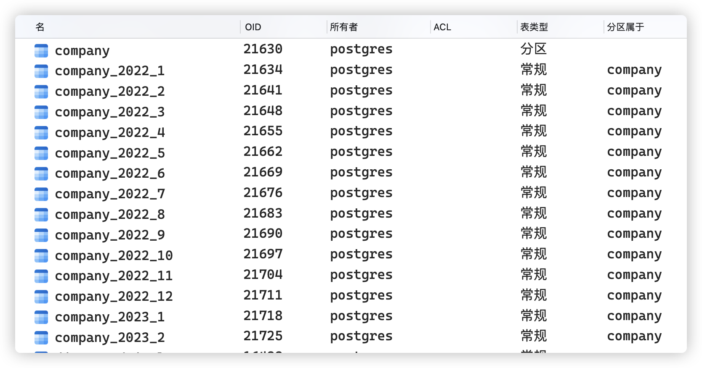
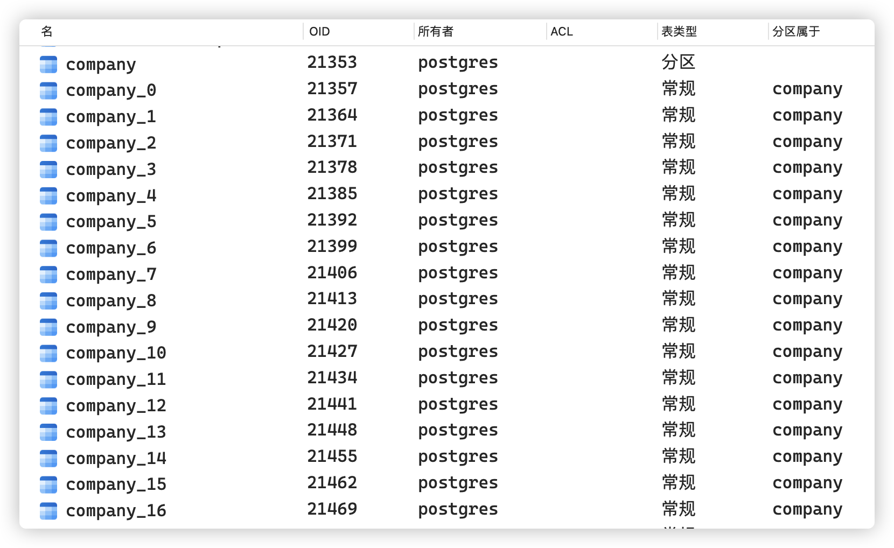

# 环境
* pg 15
* python3.11
* pip install arrow 'psycopg[binary]'
# 配置

1. pg配置文件添加下列两行<br>

```
enable_partition_pruning = on
enable_partitionwise_aggregate = on
```

# 步骤描述

1. 原建表语句末尾添加 PARTITION BY [ RANGE | List ] (column)
2. CREATE INDEX ON company (PRO);官方推荐但非必需。
3. 创建子表，子表可以位于不同的tablespace，以免public不美观。

* RANGE:<br>

```sql
CREATE TABLE company ...PARTITION BY RANGE(PRO);
-- 前闭后开
CREATE TABLE company_1 PARTITION OF company FOR VALUES FROM (rang1_start) TO (rang1_stop);
```


* List:<br>

```sql
CREATE TABLE company ...PARTITION BY LIST(PRO);
CREATE TABLE company_1 PARTITION OF company FOR VALUES IN (x);
```


* 还有一种取余, 随着数据增多不方便。

# 索引事项

* 父表只是管理子表的逻辑形式，不存储数据，不能保证全局唯一，不存在全局索引。
* 若查询语句没用where语句指定分区字段筛选，则遍历所有索引或扫描全部子表。
* 给父表创建索引，已有与未来的子表都会自动建立索引。
* 通过父表创建唯一索引，必须包含分区字段，只能使子表内唯一; 可以分别操作子表创建唯一索引。
* 传统的单列 PRIMARY KEY 不可用；虽然可以创建id自增列但没必要。

# 使用

* 增删改查通过父表
* 不用的子表可直接drop, 删除父表的同时也自动删除子表。
* 与手工分表本质相同，内置的分表使查询简单些。
